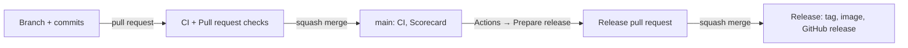

# Workflows

What each GitHub Actions workflow does, when it runs, and what to do when it fails.
The names below are the ones in the Actions tab and in a pull request's checks
(`CI / Lint and checks`). Every workflow file also starts with a comment on what it's
for. GitHub has no description field for workflows.

## The life of a change

1. **Pull request:** `CI` and `Pull request` run. Every job they run must pass
   before you can merge. These are the required checks on `main`. CI's last job,
   `SonarQube Cloud`, analyses the code with the tests' coverage and reports on the
   pull request.
2. **Merge to `main`:** `CI` runs again on the merged state, and so does `Scorecard`.
   `Release` starts too, but it only checks whether the commit is a release and stops
   if it isn't.
3. **Release:** run `Prepare release` by hand. It opens a release pull request.
   Merging that pull request runs `Release`, which publishes everything. See
   [CONTRIBUTING.md](../../CONTRIBUTING.md#releases-maintainers).
4. **Every Monday:** `Scorecard`, `Image scan` and `Links` run, along with
   Dependabot's update pull requests ([dependabot.yaml](../dependabot.yaml)).

## At a glance

| Workflow                | File                                                     | Runs                                   | Purpose                                                                                      |
| ----------------------- | -------------------------------------------------------- | -------------------------------------- | -------------------------------------------------------------------------------------------- |
| CI                      | [ci.yaml](ci.yaml)                                       | pull requests, push to `main`, by hand | Lint, tests, browser tests, Docker image build and scan                                      |
| Pull request            | [pull-request.yaml](pull-request.yaml)                   | pull requests (title, new pushes)      | Conventional Commits title (it becomes the changelog line)                                   |
| Pull request title help | [pr-title-help.yaml](pr-title-help.yaml)                 | pull requests (opened, title edited)   | A comment that explains a bad title and how to fix it                                        |
| Dependabot auto-merge   | [dependabot-auto-merge.yaml](dependabot-auto-merge.yaml) | Dependabot's pull requests             | Auto-merge for safe updates (dev tools and actions, patch and minor) once approved and green |
| Prepare release         | [prepare-release.yaml](prepare-release.yaml)             | by hand                                | Version bump on a `release/vX.Y.Z` branch, opens the release pull request                    |
| Release                 | [release.yaml](release.yaml)                             | push to `main`, a `v*.*.*` tag         | Docker image, tag, GitHub release (only for a release commit)                                |
| Scorecard               | [scorecard.yaml](scorecard.yaml)                         | push to `main`, weekly, by hand        | OpenSSF security rating, README badge (public repository only)                               |
| Image scan              | [image-scan.yaml](image-scan.yaml)                       | weekly, by hand                        | Vulnerabilities in the published `:latest` image (public repository only)                    |
| Links                   | [links.yaml](links.yaml)                                 | weekly, by hand                        | Broken links in the Markdown files (public repository only)                                  |

## CI

The main quality gate. Locally, `npm run check` and `npm run test:e2e` run the same
checks.

| Job                                | What it checks                                                                                                                                                                                                                                    | When it fails                                                                                                                                                                                                 |
| ---------------------------------- | ------------------------------------------------------------------------------------------------------------------------------------------------------------------------------------------------------------------------------------------------- | ------------------------------------------------------------------------------------------------------------------------------------------------------------------------------------------------------------- |
| Lint and checks                    | `npm run check` without the tests: Prettier, ESLint, Stylelint, markdownlint, CSpell, Ruff, Pyright, ShellCheck, Hadolint, actionlint, zizmor, LF line endings. Then zizmor's online audits (known-vulnerable or impostor action commits).        | Run `npm run format`, then `npm run check`, and fix what remains. Add a new word to `cspell.config.yaml`.                                                                                                     |
| Tests (Python 3.10), (Python 3.14) | The Python unit tests and the whole export against a fake Jellyfin and Seerr, on the oldest and newest supported Python. The coverage table is in the run's summary.                                                                              | Run `npm test`. A failure on 3.10 only usually means newer Python syntax or library use.                                                                                                                      |
| Browser tests                      | The `src/js/lib.js` unit tests, then the demo page in Chromium (Playwright) with an accessibility scan (axe) and coverage of `src/js/` per module (in the run's summary; the full report is the `coverage-e2e` artifact).                         | Run `npm run test:js` and `npm run test:e2e`. The run's `playwright-report` artifact holds traces and screenshots. Coverage below the minimum: add tests for the uncovered lines (`coverage/e2e/index.html`). |
| SonarQube Cloud                    | The code analysis with the coverage of the test jobs, for `main` and pull requests from this repository's branches (forks and Dependabot are skipped). On a pull request it fails with the quality gate. See [SonarQube Cloud](#sonarqube-cloud). | Fix the issues SonarQube Cloud lists on the pull request, or add tests for the uncovered new lines.                                                                                                           |
| Docker image builds                | Builds the image (not pushed). Runs it once against the fake server, hardened like `compose.yaml`. Starts it in scheduled mode until it's healthy. Scans it with Trivy for fixable HIGH / CRITICAL vulnerabilities.                               | Run `docker build`. For Trivy findings: merge Dependabot's base image update, or bump the digest in the `Dockerfile`. `apk upgrade` covers fixes between images.                                              |

## Pull request

| Job      | What it checks                                                                                                                                              | When it fails                                                                                                           |
| -------- | ----------------------------------------------------------------------------------------------------------------------------------------------------------- | ----------------------------------------------------------------------------------------------------------------------- |
| PR title | The title follows Conventional Commits (`commitlint.config.mjs`) and CSpell knows its words. It becomes the commit on `main` and the line in the changelog. | Edit the title (`feat(page): …`, `fix: …`), or add a real word to `cspell.config.yaml`. The check runs again by itself. |

When the title fails, **Pull request title help** comments on the pull request: what's
wrong in plain words, a table of title types and their release-notes sections, the
scopes, and the words the spell checker doesn't know (`scripts/pr_title.py`). Words
the pull request adds to `cspell.config.yaml` itself count as known, and so do scopes
it adds to `commitlint.config.mjs`: both files are read through the API as text, never
used as a config (a fork's config could import code). The comment updates itself once the title is
fixed, showing the line the pull request will get in the release notes. A good
title from the start gets no comment. The failing run's summary has the same
explanation.

It runs on `pull_request_target`, so it can comment on pull requests from forks
too. That trigger runs with the repository's rights, so it never runs code from
the pull request: it checks out `main` and only reads the title. Keep it that way:
no `ref:` to the pull request's branch in that workflow.

## Prepare release

Run it from **Actions → Prepare release → Run workflow** with `patch`, `minor`,
`major`, a release candidate (`rc` for the next one, `prepatch` / `preminor` /
`premajor` to start one; see
[CONTRIBUTING.md](../../CONTRIBUTING.md#releases-maintainers)) or an exact version
(`1.2.0-rc.1`). The run's title shows what you asked for:
"Prepare release (minor)". Its summary shows the resulting version and links the
pull request.

- **Release branch and pull request:**
  - Adds a line to `[Unreleased]` in `CHANGELOG.md` for every pull request merged
    since the last release, from its title, with its author and the issues it
    fixes (`scripts/changelog.py`; the token reads them from GitHub).
  - Bumps `__version__` in `marqueefin/__init__.py` and, for a final version, turns
    `[Unreleased]` into the version's section (`scripts/release.py`).
  - Commits it as the bot, through the API, so GitHub signs it (Verified) and the
    squash merge on `main` is fully verified. The pull request says who started it. (Authored by that person, the squash merge
    would list them as a co-author, and GitHub can't verify a co-author's
    signature: "partially verified" for anyone who flags unsigned commits.)
  - Spell-checks the new notes. Words CSpell doesn't know (from squash-description
    lines, which nothing checked before) show in a warning box at the top of the pull
    request, which can't be merged until they're reworded or added to
    `cspell.config.yaml` on the branch.
  - Checks the commit titles since the last release (`scripts/release.py titles`).
    One without a Conventional Commits type, without a pull request number, or
    starting with a list marker (a squash merge that took a description line as its
    title) shows in a second warning box: check its line in `CHANGELOG.md`.
  - The release bot (a GitHub App) pushes `release/vX.Y.Z` and opens the pull
    request "chore(release): vX.Y.Z", so `CI` and `Pull request` start on it like
    on anyone's (a pull request opened with the workflow's own token starts none).
- **Fails at "Bot token":** the environment `release` needs the variable or secret
  `APP_RELEASE_BOT_ID` (the App's Client ID or App ID) and the secret
  `APP_RELEASE_BOT_KEY` (its private key), and the App must be installed on this
  repository with Contents and Pull requests: read and write.
- **Fails because the tag exists:** that version is taken. Run it again with a
  different version.
- **Fails with "nothing merged since vX":** nothing has been merged since the last
  release, so there's nothing new to release. The one exception: turning that
  release's candidate into its final version (`1.2.0-rc.3` to `1.2.0`, the same code).

## Release

Runs on every push to `main`, but only publishes for a release commit.

| Job                | What it does                                                                                                                                                                                                                                                                        |
| ------------------ | ----------------------------------------------------------------------------------------------------------------------------------------------------------------------------------------------------------------------------------------------------------------------------------- |
| Is this a release? | Releases only when the commit title is `chore(release): vX.Y.Z` and the commit changes `__version__` to that version, which has no tag yet. A pushed `vX.Y.Z` tag must match `__version__`. Anything else: "nothing to release", done.                                              |
| Release vX.Y.Z     | Builds the image for amd64 and arm64 and pushes it to `ghcr.io` (`:X.Y.Z`, `:X.Y`, `:X`, `:latest`, `:next`; a pre-release gets `:X.Y.Z` and `:next`). Adds an SBOM and provenance. Then creates the tag and the GitHub release, with the version's changelog section as its notes. |

- **A merged release pull request didn't publish:** check the commit title on `main`.
  The squash merge must keep the suggested title, `chore(release): vX.Y.Z (#12)`.

## Dependabot auto-merge

Runs on Dependabot's pull requests and turns on auto-merge when **every** update in
it is safe: a patch or minor version of a development tool (npm devDependencies,
the Python tools in `requirements-dev.txt`) or of an action. Such a pull request then
merges by itself once all required checks are green and you've approved it (the
`reviews` ruleset still applies, so nothing merges unseen). Updates of what users run
(the page's npm packages: Floating UI, the fonts, esbuild; the Docker base images)
and every major version stay manual. The run's summary says which and why.

- **Fails with "auto merge is not allowed":** turn on Settings → General → Pull
  Requests → **Allow auto-merge**.
- **Approved, but it doesn't merge:** the branch is behind `main` (the ruleset wants
  it up to date). Comment `@dependabot rebase`, then approve again: a new push drops
  the approval.

## SonarQube Cloud

The `SonarQube Cloud` job in CI, after the test jobs: it takes their coverage reports
(`coverage-python`, `coverage-js`, `coverage-e2e`) and sends the analysis to SonarQube
Cloud, which comments on the pull request: new issues, and how much of the new code
the tests cover. On a pull request the job waits for the quality gate and fails with
it, so it's a required check.

- **Pull requests from forks are skipped** (the job passes): their runs get no
  secrets, and running the scanner with the token on a fork's code isn't safe (it
  reads its settings from the checkout). `main`'s analysis after the merge shows their
  code as new code. Before merging, check one out (`gh pr checkout <n>`) and look at
  it with SonarQube for IDE.
- **Dependabot's pull requests are skipped too:** they get Dependabot secrets, not
  Actions secrets. Add `SONAR_TOKEN` under Dependabot secrets to analyze them.
- **Setup:** the secret `SONAR_TOKEN` (SonarQube Cloud → My Account → Security, best a
  project analysis token) and the variables `SONAR_ORGANIZATION` and
  `SONAR_PROJECT_KEY` (the project's Information page). Turn off **Automatic
  Analysis** in the project's Administration → Analysis Method: with both on, the
  analysis fails. Without the token the job does nothing.
- **Per release:** analyses of `main` carry the version (`sonar.projectVersion`, from
  `marqueefin/__init__.py`). With the project's **New Code** set to **Previous
  version** (Administration → New Code), `main`'s page shows the coverage and issues
  of everything since the last release (or release candidate), and the Activity graph
  marks each version.
- **A coverage download failed:** that test job failed or didn't run; the analysis
  runs without that coverage.
- **The quality gate fails on coverage:** add tests for the new lines; SonarQube
  Cloud's pull request page lists them.

## Weekly (public repository only)

These skip themselves while the repository is private.

- **Scorecard:**
  - Rates the repository's security practices: pinned dependencies, token
    permissions, branch protection, signed releases.
  - Results go to the Security tab and the README badge.
- **Image scan:**
  - Trivy on the published `:latest` image. New vulnerabilities turn up in old
    images too.
  - Findings go to the Security tab.
  - To fix one: merge Dependabot's base image update, then release.
- **Links:**
  - lychee checks every link in the Markdown files (`lychee.toml`).
  - It doesn't run on pull requests, so another site being down can't block a merge.
  - Fix or remove the dead link, or exclude it in `lychee.toml` if it's a false
    alarm.

## Conventions

- **Actions are pinned to a commit SHA**, with the version in a comment. Dependabot
  updates both.
- **Permissions are as narrow as possible:** read-only by default, and write
  permissions only on the job that needs them, with a comment saying why.
- **No install scripts in CI:** `npm ci --ignore-scripts`. Python tools are installed
  with `--require-hashes`.
- **Renaming a job** in `ci.yaml` or `pull-request.yaml` renames a required check.
  Update the ruleset on `main` too.
