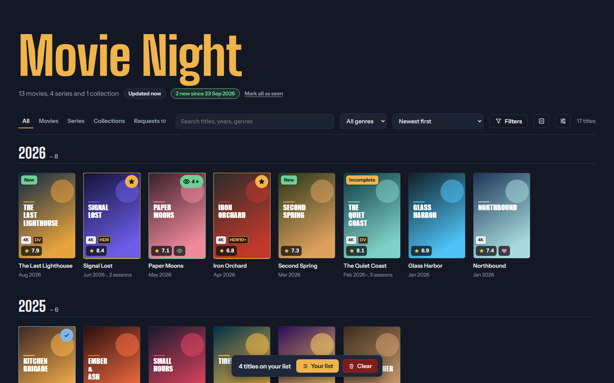
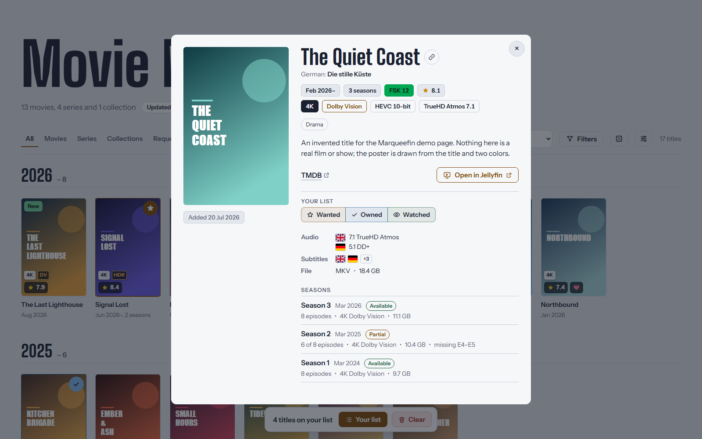

> [!NOTE]
> **AI-assisted project.** Marqueefin was built with AI-assisted development: most
> of the code and documentation was written with an AI coding assistant and
> reviewed, tested and directed by the maintainer.
>
> This project started as a proof of concept: what AI-assisted development can do,
> and how to build and maintain a repository by best practices. Without that it
> wouldn't exist as a public project with these features and this level of quality,
> so please keep that in mind. It's provided as is, and new features and
> improvements are welcome (see [Contributing](#️-contributing) below).

<p align="center"></p>

<h1 align="center">Marqueefin</h1>

<p align="center">
  <strong>Your Jellyfin library as one beautiful page to share with your friends.</strong>
</p>

<p align="center">
  <a href="https://github.com/TheDelta/marqueefin/actions/workflows/ci.yaml"></a>
  <a href="https://github.com/TheDelta/marqueefin/releases"></a>
  
  <a href="LICENSE"></a>
  <a href="https://github.com/TheDelta/marqueefin/pkgs/container/marqueefin"></a>
  <br>
  <a href="https://sonarcloud.io/summary/new_code?id=TheDelta_marqueefin"></a>
  <a href="https://sonarcloud.io/summary/new_code?id=TheDelta_marqueefin"></a>
  <a href="https://scorecard.dev/viewer/?uri=github.com/TheDelta/marqueefin"></a>
</p>

<p align="center">
  
</p>

Your friends ask "what do you have?" and "is the new season there yet?". Marqueefin
answers that with a single HTML file: your whole Jellyfin library (movies, series and
collections) with posters, ratings, seasons, picture and sound quality, and what's
new since their last visit. They keep their own list of what they want to watch,
what they own too and what they've seen, and can share it with you in one click to
compare.

- **One file.** Posters, styles and scripts are inside the page. Send it, or host it
  anywhere that serves a static file. No server-side code, no database, no Jellyfin
  account for your friends.
- **Works offline, tracks nobody.** Everything is in the page, fonts included: it
  makes no outside request at all, and a strict Content Security Policy keeps it
  that way. The viewer's list stays in their browser.
- **Your server stays private.** Friends never reach Jellyfin; the page only holds
  what you exported.

> Marqueefin is an independent project. It is **not affiliated with, endorsed by or
> part of the [Jellyfin](https://jellyfin.org) project**. "Jellyfin" is used only to
> describe what it works with.

## ✨ Features

### Browse

- Every movie, series and collection with poster, release month, runtime, age rating,
  ★ score, genres, overview and links to IMDb, TMDB and TVDB.
- Picture and sound at a glance: 4K / 1080p, Dolby Vision, HDR10(+), HLG, codec and
  bit depth, the best audio track (e.g. TrueHD Atmos 7.1) and every audio and
  subtitle language as a flag.
- Seasons per series: **Available**, **Airing** (with the next episode date),
  **Partial** (which episodes are missing), **Missing** or **TBA**.
- Search, sorting (newest, A–Z, recently added, highest rated, recently watched), a
  view grouped by release year, an optional card per season, and filters for year,
  rating, resolution, watched and favorites.
- 🎲 **Surprise me**: a random title from the ones shown, for when nobody can decide.
- **New since your last visit**: new titles, seasons and collection entries stay
  highlighted until the viewer marks them as seen.
- Your watched and favorite status (optional), a light, dark or automatic theme,
  and a link to every single title (`#item=…`).
- 🌍 In **English, German, French or Spanish**, whichever your friend's browser
  prefers (switchable in Settings), and titles in a second language on request
  (`--title-language de`, `fr`, `pt-BR`, … any language TMDB knows). The French and
  Spanish texts are AI translations that no native speaker has reviewed yet:
  corrections are welcome (`src/i18n/fr.json`, `es.json`, see
  [CONTRIBUTING.md](CONTRIBUTING.md#translations)).

### Share

- 🔒 Optionally **protected with a passphrase**: the library is sealed inside the page
  and friends type the passphrase to open it (and can let their browser remember it),
  so the page can sit anywhere, even on a public web space.
- Your friends keep their own list: ⭐ **wanted** (want to watch), ✔ **owned** (have
  it too) and 👁 **watched**, with a 1–5 star rating and the date of each change.
- They copy the list as text with links, plain titles or CSV: to compare notes with
  you, or as a backup. Importing it restores the list, e.g. after clearing the
  browser data or on another device.
- 🔗 Or as a **link to your page** with the list inside (about 18 characters a title,
  nothing stored anywhere).
- 🆚 **Compare lists**: paste a friend's list or open their link to see what you both
  want, who has what the other wants, and what you both watched with both ratings.

### Requests (optional)

- Open requests from [Seerr](https://github.com/seerr-team/seerr) on their own tab:
  awaiting approval, release dates (cinema, digital), which seasons have aired, and a
  shortcut when part of the title is already in your library.

### Run it your way

- Python standard library only, no `pip install`.
- Fast repeat runs: posters and slow lookups are cached (a 700-title library
  refreshes in about 30 seconds).
- A Docker image that builds the page on a schedule, uploads it over SFTP and sends a
  [Gotify](https://gotify.net) message when a run fails.

<p align="center">
  
</p>

## 📋 Requirements

**To export** (or use the [Docker image](#-docker), which brings everything):

- A **Jellyfin** server (tested with 12.1) and an API key (Jellyfin: **Dashboard → API
  Keys → +**).
- **Python 3.10+**, standard library only.
- **Node.js 24** with npm, to build the page's script and styles and to install
  [Floating UI](https://floating-ui.com) and the fonts, which are built into the page.
- Optional: [Seerr](https://github.com/seerr-team/seerr) (tested with 3.4) and its API
  key, for the Requests tab and titles in a second language.

**To view the page:** a current browser (Chrome, Edge, Firefox, Safari, also on phones)
with JavaScript on. Nothing else, no account, no server-side code. A page
[protected with a passphrase](#-sharing-with-your-friends) opens over https or as a
file on the device, not over plain http: browsers allow their cryptography only
there.

## 🚀 Quick start

With the [requirements](#-requirements) in place:

```sh
git clone https://github.com/TheDelta/marqueefin.git
cd marqueefin
npm ci && npm run build       # once, and again after updates
cp .env.example .env          # then set JELLYFIN_URL and JELLYFIN_API_KEY
python export.py              # writes collection.html
```

Open `collection.html` in your browser. The first run takes a few minutes on a large
library; later runs reuse the cache in `.marqueefin_cache/`.

Want to look around first? `python scripts/demo_page.py` writes `demo.html` with
made-up titles, no server needed.

### Examples

```sh
# A title for the page, written straight to your web folder
python export.py --title "Movie Night" -o /var/www/library/index.html

# Only some libraries (see their names first)
python export.py --list-libraries
python export.py --library "Movies" --library "Kids"

# Movies and collections only, without your watched / favorite status
python export.py --types movies,collections --no-user-data

# A smaller HTML file: posters in a folder next to it (zip both to send)
python export.py --posters folder

# The quickest run: skip the season check and the file details
python export.py --no-seasons --no-media

# A big library (thousands of titles): smaller posters, a page that opens faster
python export.py --poster-width 200 --poster-quality 60

# Add the Requests tab (or set SEER_URL / SEER_API_KEY in .env)
python export.py --seerr-url http://192.168.1.10:5055 --seerr-api-key YOUR_SEERR_KEY
```

`python export.py --help` lists every option. Settings are read from command-line
flags first, then environment variables, then `.env` (see
[.env.example](.env.example)).

## 🤝 Sharing with your friends

1. **Send the page.** Email or message the HTML file, or host it: any web server
   that serves a static file works. It lists your library and, unless you pass
   `--no-user-data`, what you've watched, so keep it private: put it behind a password
   (e.g. HTTP basic auth), or **protect the page itself with a passphrase**:

   ```sh
   EXPORT_PASSPHRASE="four random words here" python export.py
   ```

   The library, posters and requests are then sealed (PBKDF2-SHA256, SHAKE256,
   HMAC-SHA256); the page shows only its title and a passphrase field until the right
   passphrase is typed. Choose a long one (a few random words): whoever has the file
   can try passphrases offline. It works when the page is opened over https or as a
   file, and needs the posters inside the page (`--posters embed`, the default). In
   Docker, `EXPORT_PASSPHRASE_FILE` reads it from a secret.

2. **They browse and keep a list.** The star button on a poster or in a title's
   details adds it as wanted; from there they mark it as owned (they have it too) or
   watched, and rate what they've watched. The bar at the bottom shows the list.
3. **Compare and back up.** **Your list → Copy** gives something like this:

   ```text
   Movies
   [3f2a9c41d0b84e6a9a1c5e7d2b8f0a13] Iron Orchard (2026) https://www.imdb.com/title/tt0000000/
   [8c1d4e7f2a3b4c5d9e8f7a6b5c4d3e2f|w4|2026-09-30 20:15] Paper Moons (2026) ★4/5 https://www.imdb.com/title/tt0000001/

   Series
   [b7e6d5c4a3f24e1d8c9b0a1f2e3d4c5b|o|2026-09-27 18:02] Kitchen Brigade (2025–) https://www.themoviedb.org/tv/0
   ```

   The bracket holds the Jellyfin id, the state (`o` owned, `w` watched, plus their
   rating) and when it changed. Share it to see what you both have, what you've
   both watched and how you rated it. **Exclude ids** gives a cleaner list for
   reading; **Only wanted** leaves out what's owned or watched; CSV suits a
   spreadsheet. **Copy as link** puts the list into a link to the page instead
   (`…/#list=…`); whoever opens it can compare it with their own list or import it.
   It works where the page is online, not for a file on someone's device.
   **Compare with my list** (in the import dialog) groups both lists: what you both
   want, what one wants and the other has, what you both watched, and what's only on
   one of them.

4. **Keep a backup.** The list lives only in the viewer's browser, so clearing the
   browser data deletes it. A copied list (with ids) is a backup:
   **Settings → Import a list…** restores it, also on another device.

When you export again, their list stays: it's stored in their browser by title id.

## 🐳 Docker

The image runs next to Jellyfin, builds the page on a schedule (cron syntax), uploads
it over SFTP to a locked-down account on your web server and reports failures to
Gotify. It runs as a non-root user with a read-only file system.

```sh
cp .env.example .env                       # Jellyfin, Seerr, SCHEDULE, upload settings
docker compose run --rm -e SCHEDULE= marqueefin   # one test run
docker compose up -d --wait                # then on the schedule
```

Pre-built images (amd64 and arm64) are published as
`ghcr.io/thedelta/marqueefin:<version>`, `:1`, `:latest` and `:next` (release
candidates too).
**[docker/README.md](docker/README.md)** covers the whole setup: reaching Jellyfin on
the same host, the SFTP-only upload account, a web server example, health checks and
notifications.

## 🔢 Versions

Marqueefin follows [Semantic Versioning](https://semver.org/). A new major version
means something you rely on changed: settings, command-line flags, the copied list
format or the Docker setup. Pin the image to `:1` to get fixes and features without
breaking changes. See [CHANGELOG.md](CHANGELOG.md) for what changed.

## 💬 Questions, ideas and bugs

- **Questions and help:** please use
  [Discussions → Q&A](https://github.com/TheDelta/marqueefin/discussions/categories/q-a)
  rather than an issue.
- **Ideas:** open a [feature request](https://github.com/TheDelta/marqueefin/issues/new?template=feature_request.yaml)
  or start a discussion.
- **Bugs:** open a [bug report](https://github.com/TheDelta/marqueefin/issues/new?template=bug_report.yaml).
- **Security issues:** please report them privately, see [SECURITY.md](SECURITY.md).

## 🛠️ Contributing

Contributions are welcome! [CONTRIBUTING.md](CONTRIBUTING.md) explains the setup, the
checks and how to propose a change, and [AGENTS.md](AGENTS.md) describes how
Marqueefin works inside (also meant for AI coding agents). Please follow the
[Code of Conduct](CODE_OF_CONDUCT.md).

## 📄 License

[MIT](LICENSE). The page includes [Floating UI](https://floating-ui.com) (MIT); its
license text is embedded in every exported page. Language flags come from
[flag-icons](https://github.com/lipis/flag-icons) (MIT).

Movie and series data and artwork belong to their owners and come from your own
Jellyfin server (and Seerr / TMDB for requests). Marqueefin doesn't ship or host any
of it.
